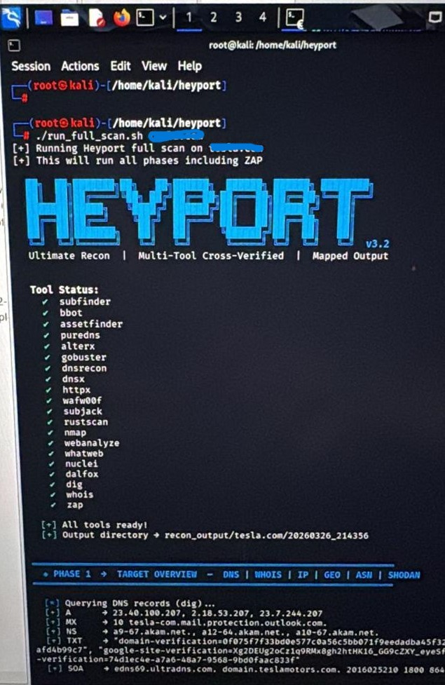

# 🔍 OWASP ZAP CLI Integration — Heyport v3.2


> **Contributed OWASP ZAP CLI integration into Heyport v3.2** — an existing multi-tool network reconnaissance framework. This contribution adds Phase 5 active web vulnerability scanning capability using a custom `zap_scanner.py` wrapper built on the `python-owasp-zap-v2.4` library.

**Role:** Security Tool Developer
**Contribution:** OWASP ZAP Phase 5 Integration
**Framework:** Heyport v3.2 — Multi-Tool Recon Framework
**Library:** python-owasp-zap-v2.4
**Platform:** Kali Linux

---



## What is Heyport?

Heyport v3.2 is a multi-tool reconnaissance framework that orchestrates 20 security tools through a single Python interface. It runs structured phase-by-phase enumeration — from passive OSINT through to active vulnerability scanning — consolidating results into unified output.

**Tool Status confirmed in screenshot:**
subfinder, bbot, assetfinder, puredns, alterx, gobuster, dnsrecon, dnsx, httpx, wafw00f, subjack, rustscan, nmap, webanalyze, whatweb, nuclei, dalfox, dig, whois, **zap** ✅

---

## My Contribution — Phase 5 ZAP Integration

Heyport already had Phases 1-4 covering passive recon, port scanning, web fingerprinting, and vulnerability scanning. **Phase 5 was missing** — deep active web application scanning. I was asked to integrate OWASP ZAP into the existing pipeline.

**The problem with existing ZAP CLI tools:**
The legacy `zapcli` tool — the most commonly used Python wrapper for ZAP — fails on Python 3.13 with import errors. It is no longer maintained and incompatible with current Kali Linux Python environments. Simply installing zapcli and calling it from Heyport was not possible.

**The solution — custom zap_scanner.py wrapper:**
Rather than relying on the broken legacy tool, I built a custom `zap_scanner.py` module using the `python-owasp-zap-v2.4` library — the official OWASP Python client for ZAP's REST API. This wrapper integrates directly into Heyport's phase architecture and communicates with the ZAP daemon via its API rather than through the broken CLI layer.

## Technical Implementation

**How the ZAP integration works:**

OWASP ZAP operates as a daemon process that exposes a REST API on localhost. The `python-owasp-zap-v2.4` library provides a Python client that communicates with this API. My `zap_scanner.py` module:

1. **Starts the ZAP daemon** — launches ZAP in headless mode on a configured port
2. **Spiders the target** — ZAP crawls the target web application, discovering all pages, forms, and endpoints
3. **Runs active scan** — ZAP performs active vulnerability testing against all discovered endpoints
4. **Collects alerts** — retrieves all findings from the ZAP API with severity, description, and URL
5. **Returns structured output** — passes results back to Heyport's unified reporting pipeline

**Why this approach is superior to zapcli:**
- Communicates directly with ZAP REST API — no CLI layer that can break
- Compatible with Python 3.13 — no legacy dependency issues
- Fully programmatic — scan parameters, thresholds, and output format all controllable in code
- Integrates cleanly into Heyport's existing phase architecture

**Installation:**
```bash
# Install ZAP
sudo apt install zaproxy -y

# Install Python client library
pip install python-owasp-zap-v2.4

# ZAP integration is automatically included in Phase 5
./run_full_scan.sh <target>
```

**How Phase 5 fits into the full pipeline:**
```
Phase 1 — Passive Recon     (subfinder, bbot, DNS)
Phase 2 — Active Scanning   (nmap, rustscan)
Phase 3 — Fingerprinting    (whatweb, wafw00f, httpx)
Phase 4 — Vuln Scanning     (nuclei)
Phase 5 — Web App Analysis  (ZAP active scan, dalfox XSS) ← My contribution
```

## Why This Contribution Matters

**OWASP ZAP is industry-standard:**
ZAP (Zed Attack Proxy) is one of the most widely used open-source web application security scanners in the world — maintained by OWASP and used by security professionals, bug bounty hunters, and penetration testers globally. Integrating it into an automated recon pipeline elevates Heyport from a network reconnaissance tool to a full web application security assessment framework.

**The gap it fills:**
Phases 1-4 of Heyport cover infrastructure-level reconnaissance excellently — subdomain enumeration, port scanning, service fingerprinting, and CVE detection. But web application vulnerabilities — XSS, SQL injection, insecure forms, missing security headers, CSRF — require a dedicated web application scanner that understands HTTP at the application layer. ZAP fills this gap completely.

**Real-world impact:**
With Phase 5 active, a single `./run_full_scan.sh tesla.com` command now runs the complete security assessment pipeline from DNS enumeration through to active web application vulnerability scanning — producing a comprehensive picture of the target's attack surface that would previously require running multiple tools manually and correlating results by hand.

---

## Skills Demonstrated

`Python Development` `OWASP ZAP` `REST API Integration` `Security Tool Development`
`Web Application Security` `Reconnaissance Automation` `Kali Linux` `python-owasp-zap-v2.4`
`Phase Architecture Design` `Open Source Contribution`

---

## Disclaimer

> This tool and its ZAP integration are intended for authorized security testing only.
> Only use against systems you own or have explicit written permission to test.
> Unauthorized scanning is illegal and unethical.

---

*Ayesha | Information Security Analyst | Vital Medicure Labs*
